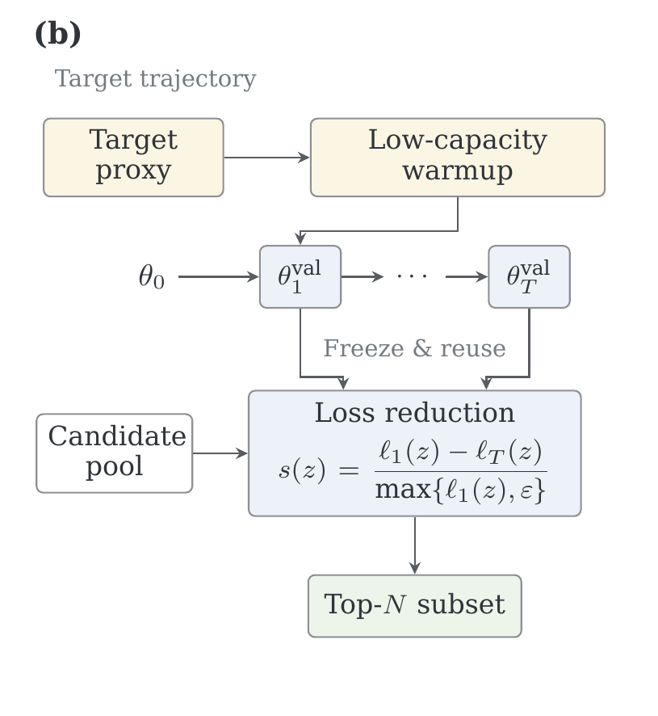

# TACS: Data Selection via Target-Aligned Paths

Code for **Let the Target Select for Itself: Data Selection via Target-Aligned Paths**.

**[Paper](https://arxiv.org/abs/2605.09404)** · **[Reproduction guide](docs/reproduce.md)** · **[Protocol](configs/paper_protocol.json)**

Targeted data selection depends on the model states used to judge candidate
examples. TACS studies this *reference-path dependence*: changing the warmup
data can change candidate rankings and selected subsets even when the pool,
target task, and scoring rule stay fixed.

TACS builds a short, low-capacity reference path from a compact target-validation
proxy and calibrates its depth to the target task. It ranks candidates by their
normalized loss reduction between the path's endpoints. The path can be reused
across candidate pools, and candidate scoring requires only forward passes.
The selected subset is then used for ordinary fine-tuning. The repository
includes the controlled logistic and vision studies and the instruction-tuning
workflow used in the paper.

## Method at a glance

<p align="center">
  
</p>

The target proxy drives a low-capacity warmup path. Its frozen endpoints are
reused to score each candidate pool by normalized loss reduction, then the
highest-scoring examples form the training subset (Figure 1b in the paper).

1. **Build a target path.** Warm up a rank-one adapter on a small target proxy;
   use held-out folds to choose the path depth and learning rate.
2. **Score each pool.** Freeze the selected path's endpoints and measure each
   candidate's normalized loss reduction with forward passes.
3. **Train on the subset.** Select the highest-scoring 5% of each candidate
   pool, then fine-tune and evaluate the downstream model.

## Instruction-tuning results

Llama-3.2-3B results from Table 1 of the final paper. Values are mean ± standard
deviation over three seeds, averaged across four candidate pools. Random, LESS,
ToV, and TACS each train on a 5% subset; the full-pool result is a separate
reference using all candidates.

| Target task | Random | LESS | ToV | TACS | Full pool |
| --- | ---: | ---: | ---: | ---: | ---: |
| MMLU | 55.72 ± 0.15 | 55.69 ± 0.25 | 54.93 ± 0.05 | **56.08 ± 0.10** | 54.42 |
| TyDiQA | 48.07 ± 0.03 | 59.69 ± 0.42 | 57.45 ± 0.13 | **60.89 ± 0.33** | 51.97 |
| BBH | 47.40 ± 0.50 | 47.55 ± 0.19 | **47.86 ± 0.42** | 47.85 ± 0.51 | 47.34 |

TACS has the highest mean subset result on MMLU and TyDiQA. On BBH, its mean
is within 0.01 points of ToV. See the paper for the task metrics and per-pool
results.

## Quick start

```bash
python -m venv .venv
source .venv/bin/activate
pip install -e '.[dev]'
python -m pytest -q tests
```

To try the selection code without model weights or external datasets, run the
synthetic logistic example on CPU. It generates its own data:

```bash
python experiments/logistic_shift/run_logistic_shift_tacs.py \
  --quick --output runs/logistic_quick.json
```

## What is where?

| Path | Purpose |
| --- | --- |
| `tacs/data_selection/` | Target warmup, candidate loss scoring, LESS and ToV baselines, subset export |
| `tacs/train/` | Instruction-tuning and baseline training |
| `tacs/metrics/` | Loss-drop and ranking metrics |
| `scripts/pipeline/` | Cross-validation splits and ablation summaries |
| `scripts/rebuttal/` | Held-out specificity scoring and calibration choice |
| `experiments/logistic_shift/` | Controlled logistic experiments |
| `experiments/cv_cifar10_noisy/` | Clean and noisy CIFAR-10 experiments |
| `evaluation/eval/` | MMLU, BBH, and TyDiQA evaluation |
| `scripts/analysis/` | Paper figure and cost-analysis utilities |

## Instruction-tuning workflow

1. Put candidate JSONL files and target evaluation data in the layout shown in
   [`configs/data_layout.example.yaml`](configs/data_layout.example.yaml).
2. Create three target-proxy folds with
   `scripts/pipeline/prepare_val_warmup_cv_splits.py`.
3. Train rank-one target trajectories over the paper's learning-rate and depth
   grid. Measure held-out specificity with
   `scripts/rebuttal/alignment_calibration_scorer.py`; select the best complete
   cell with `scripts/rebuttal/summarize_specificity_calibration.py`.
4. Run `python -m tacs.data_selection.val_warmup_loss_gap` on the full target
   proxy at the selected settings, using `--score_metric final_drop` and
   `--score_normalize_by_first`. Export the top 5% with
   `python -m tacs.data_selection.select_from_scores`.
5. Fine-tune on the selected JSONL with `python -m tacs.train.train` and evaluate
   with the task runners in `evaluation/eval/`.

The final-paper Llama-3.2-3B settings, candidate sources, calibration grid,
checkpoint choices, and experiment-to-code map are in
[`docs/reproduce.md`](docs/reproduce.md) and
[`configs/paper_protocol.json`](configs/paper_protocol.json). Run each CLI with `--help` for its full
set of options. Model weights and datasets must be obtained from their original
providers; outputs are written outside this repository.

## Citation and attribution

Please cite the [TACS paper](https://arxiv.org/abs/2605.09404). Instruction-tuning utilities adapt
code from [LESS](https://github.com/princeton-nlp/LESS); license details are in
[`THIRD_PARTY_NOTICES.md`](THIRD_PARTY_NOTICES.md).
